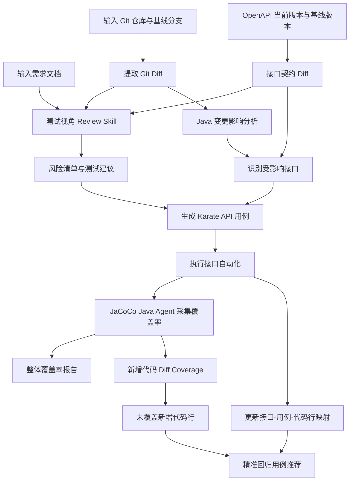
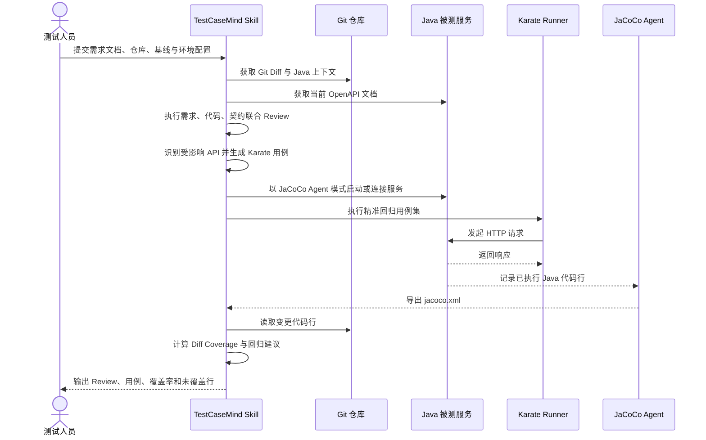
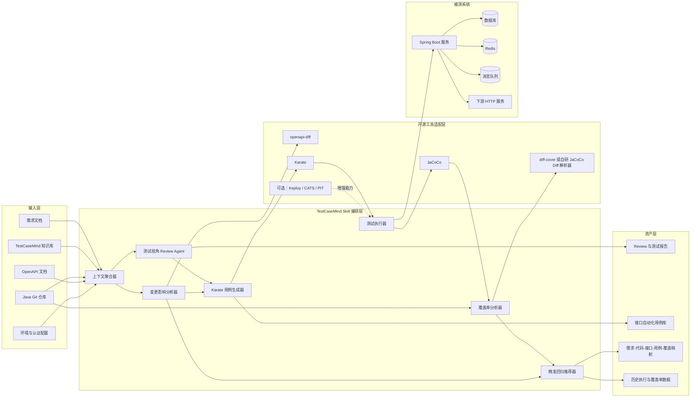

# TestCaseMind 测试视角 Code Review 与精准测试 PRD

> 文档版本：V1.0
>
> 更新日期：2026-06-02
>
> 适用对象：Java B/S 架构后端服务，优先支持 Spring Boot REST API

## 1. 产品概述

### 1.1 背景

TestCaseMind 当前已具备需求评审、测试点生成、测试用例展开和知识积累能力。研发代码提交后，仍缺少从需求到代码、从代码到接口测试、从测试到覆盖率的闭环。

本项目新增一个工程化 Skill：读取需求文档、Git 变更代码和接口契约，从测试视角执行 Code Review，生成接口自动化用例，执行测试并采集 Java 代码覆盖率，最终输出精准回归建议。

### 1.2 产品目标

1. 将需求文档、代码变更和测试资产关联起来。
2. 从测试视角识别本次代码变更的风险点和遗漏场景。
3. 自动生成可维护、可重复执行的接口自动化用例。
4. 统计整体覆盖率和新增代码覆盖率，定位未覆盖代码行。
5. 建立“需求 -> 变更代码 -> 接口 -> 用例 -> 覆盖代码行”映射，为精准回归提供依据。

### 1.3 非目标

一期不做以下事项：

- 不替代 SonarQube、Checkstyle 等通用代码质量扫描工具。
- 不承诺仅凭行覆盖率判断测试充分性。
- 不强依赖生产流量录制。
- 不自动修改业务代码。
- 不将 Keploy 作为一期必选依赖。

## 2. 用户与场景

### 2.1 目标用户

- 测试工程师：快速识别变更风险，生成和执行接口回归用例。
- 开发工程师：在提交代码后获得测试视角反馈。
- 测试负责人：查看新增代码覆盖率、风险分布和精准回归范围。

### 2.2 典型场景

开发人员完成一个 Spring Boot 需求并提交分支。测试人员向 TestCaseMind 提供需求文档、代码仓库路径、基线分支和测试环境地址。系统分析 Git Diff、Java 调用关系和 OpenAPI 变化，生成 Review 报告与 Karate 用例，执行回归后通过 JaCoCo 采集覆盖率，并列出未覆盖的新增代码行。

## 3. 核心流程



## 4. 功能需求

### 4.1 输入管理

| 编号 | 功能 | 说明 | 优先级 |
|---|---|---|---|
| FR-001 | 需求文档输入 | 支持 Markdown、Word 转换后的文本及现有 TestCaseMind 知识库检索 | P0 |
| FR-002 | Git 仓库输入 | 接收本地仓库路径、当前分支、基线分支或 Commit SHA | P0 |
| FR-003 | OpenAPI 输入 | 支持上传 OpenAPI JSON/YAML，或从 Spring Boot 服务拉取 `/v3/api-docs` | P0 |
| FR-004 | 环境配置 | 配置测试环境 URL、认证方式、环境变量和敏感字段引用 | P0 |

### 4.2 测试视角 Code Review

系统读取需求摘要、Git Diff、变更文件上下文和 OpenAPI Diff，输出结构化风险项。

| 检查类别 | 核心检查点 |
|---|---|
| 需求一致性 | 需求是否被实现、是否存在遗漏分支、实现是否超出需求 |
| 接口契约 | 路径、参数、必填项、字段类型、枚举、响应码、兼容性 |
| 参数校验 | 空值、边界值、长度、格式、非法枚举、组合条件 |
| 业务规则 | 状态流转、前置条件、互斥条件、重复提交、幂等性 |
| 数据一致性 | 事务边界、回滚、并发更新、数据库影响 |
| 权限与安全 | 鉴权、越权、敏感字段、注入风险、日志脱敏 |
| 外部依赖 | 数据库、缓存、消息队列、下游 HTTP 调用异常 |
| 可测试性 | 是否可通过 API 验证、是否缺少观测点、是否需要 Mock |

每个风险项至少包含：严重级别、需求依据、代码位置、影响接口、风险说明、建议验证方式和建议测试用例。

### 4.3 接口变更识别

1. 使用 OpenAPI 基线版本与当前版本进行对比。
2. 识别新增、删除、修改和破坏性变更接口。
3. 将 Java Controller 变更映射到 API 路径。
4. 对 Service、Repository 等非 Controller 变更，通过调用关系回溯受影响接口。
5. 当无法可靠映射时，标记为“需人工确认”，不可静默忽略。

### 4.4 接口自动化用例生成

一期默认生成 Karate DSL 用例。

| 用例类型 | 示例 |
|---|---|
| 正向用例 | 合法请求、正常状态流转、分页和筛选 |
| 边界用例 | 最小值、最大值、空集合、超长字符串 |
| 异常用例 | 缺失参数、非法格式、非法枚举、资源不存在 |
| 权限用例 | 未登录、Token 失效、角色越权、数据权限 |
| 幂等用例 | 重复提交、重复回调、重复删除 |
| 依赖异常 | 数据库异常、下游超时、缓存失效，可配置 Mock 后执行 |

生成结果必须支持人工编辑，并保存在代码仓库或独立测试资产仓库中。

### 4.5 测试执行与覆盖率

1. 使用 Maven 或 Gradle 启动 Java 服务。
2. 通过 JaCoCo Java Agent 采集行覆盖率和分支覆盖率。
3. 执行 Karate API 用例并生成测试报告。
4. 读取 JaCoCo XML 报告，统计整体覆盖率。
5. 结合 Git Diff 统计新增和修改代码行覆盖率。
6. 输出未覆盖新增代码行、所属方法、影响接口和建议补充用例。

覆盖率指标包括：

| 指标 | 说明 |
|---|---|
| Overall Line Coverage | 服务整体行覆盖率 |
| Overall Branch Coverage | 服务整体分支覆盖率 |
| Diff Line Coverage | 本次新增和修改代码行覆盖率 |
| Changed Method Coverage | 本次变更方法触达率 |
| API Scenario Coverage | 受影响接口场景覆盖情况 |

#### 4.5.1 被测服务器接入方式

不同能力的服务器接入要求不同：

| 能力 | 是否需要服务器接入 | 说明 |
|---|---|---|
| 需求驱动 Code Review | 否 | 仅读取需求文档和 Git 仓库 |
| Git Diff 与 OpenAPI Diff | 否 | OpenAPI 可由流水线生成，也可从测试环境拉取 |
| Karate 接口自动化 | 否 | 从测试执行机向服务发送 HTTP 请求 |
| Java 覆盖率采集 | 是 | Java 进程启动时加载 JaCoCo Agent；不依赖标准化日志 |
| Keploy 流量录制 | 是 | 二期可选，需要部署网络层采集能力并验证环境权限 |

JaCoCo 推荐优先使用文件导出模式，不需要额外开放监听端口：

```bash
java -javaagent:/opt/jacoco/jacocoagent.jar=destfile=/tmp/jacoco.exec,output=file \
  -jar app.jar
```

服务退出或执行 dump 后，将 `jacoco.exec` 转为 XML 供 TestCaseMind 分析。若需要按单条用例采集覆盖映射，可在隔离测试环境中使用 JaCoCo 的受控导出方式，在每条用例执行前 reset、执行后 dump。相关端口应限制为本机或测试网访问，不可暴露到生产网络。

生产环境默认不启用 JaCoCo。优先在测试环境、预发布环境或 CI 临时实例中采集覆盖率。

### 4.6 精准回归推荐

系统维护以下映射：

```text
需求条目
  -> Git 变更文件与方法
  -> 受影响 API
  -> 自动化用例
  -> 实际执行覆盖的 Java 类、方法和代码行
```

后续代码发生变更时，根据历史覆盖映射推荐最小回归集，并将以下用例自动加入执行范围：

- 覆盖变更代码行的历史用例。
- 覆盖变更方法和上游调用链的历史用例。
- 命中 OpenAPI 变更接口的用例。
- 命中需求风险项的必测用例。
- 无法确定影响范围时的兜底回归集。

## 5. Skill 设计

建议新增 Skill：`code-review-precision-testing`。

### 5.1 Skill 输入

```yaml
requirement_file: requirements/example.md
repo_path: /path/to/java-service
base_ref: origin/main
target_ref: HEAD
openapi_base: artifacts/openapi-main.json
openapi_current: http://test-env/v3/api-docs
test_base_url: http://test-env
auth_profile: test-user
build_tool: maven
```

### 5.2 Skill 输出

```text
output/<需求名>/<时间戳>/precision-testing/
├── review-report.md
├── risk-items.json
├── openapi-diff.json
├── impacted-apis.json
├── generated-tests/
│   └── karate/
├── test-report/
├── coverage/
│   ├── jacoco.xml
│   ├── overall-coverage.md
│   └── diff-coverage.md
└── regression-recommendation.json
```

### 5.3 执行时序



## 6. 技术架构



## 7. 开源组件选型

| 能力 | 一期选型 | 说明 |
|---|---|---|
| Spring Boot OpenAPI | [springdoc-openapi](https://github.com/springdoc/springdoc-openapi) | 从 Java 服务生成 `/v3/api-docs` |
| OpenAPI 变更检测 | [openapi-diff](https://github.com/OpenAPITools/openapi-diff) | 识别契约变化和兼容性风险 |
| API 自动化 | [Karate](https://github.com/karatelabs/karate) | Java 生态友好，DSL 可读性高 |
| Java 覆盖率 | [JaCoCo](https://github.com/jacoco/jacoco) | 采集行和分支覆盖率 |
| 新增代码覆盖率 | [diff-cover](https://github.com/Bachmann1234/diff_cover) 或自研解析器 | JaCoCo XML 与 Git Diff 联合分析 |
| AI Review 流程参考 | [PR-Agent](https://github.com/The-PR-Agent/pr-agent) | 借鉴 PR Diff 分析和报告结构 |
| PR 结果反馈参考 | [reviewdog](https://github.com/reviewdog/reviewdog) | 二期接入 GitHub、GitLab 评论 |
| 流量录制回放 | [Keploy](https://github.com/keploy/keploy) | 二期可选，不依赖标准化应用日志 |
| OpenAPI 负向测试 | [CATS](https://github.com/Endava/cats) | 二期补充边界和异常场景 |
| 测试有效性验证 | [PIT](https://github.com/hcoles/pitest) | 二期使用变异测试衡量断言质量 |

## 8. Keploy 定位

Keploy 是增强模块，不是一期主链路。其核心能力是通过网络层捕获请求、响应和依赖交互，生成测试与 Mock；不依赖应用输出标准化日志。

适合场景：

- 已有可访问的联调或测试环境。
- 希望将真实 HTTP 流量快速转为回归样本。
- 希望录制数据库、缓存或下游 HTTP 交互并在回放时 Mock。

限制：

- 需验证 Linux、容器、Kubernetes、HTTPS 和 Service Mesh 环境兼容性。
- 动态字段需要配置 normalize 或噪声过滤。
- 不能替代基于需求和接口契约生成的测试设计。

## 9. 非功能需求

| 类别 | 要求 |
|---|---|
| 可维护性 | 生成用例可读、可编辑、可纳入 Git 管理 |
| 可追溯性 | 风险项、接口、用例和覆盖代码行可相互跳转 |
| 安全性 | Token、密码、数据库连接串不可写入报告；日志默认脱敏 |
| 可扩展性 | 测试执行器、覆盖率解析器、代码托管平台均采用适配器模式 |
| 稳定性 | 单个接口生成或执行失败不应阻塞整个报告产出 |
| 可解释性 | 无法识别调用关系或受影响范围时必须明确标记原因 |

## 10. 验收标准

### 10.1 一期 MVP

1. 可对一个 Maven Spring Boot 项目读取需求文档和 Git Diff。
2. 可输出带代码位置和建议用例的测试视角 Review 报告。
3. 可拉取或读取 OpenAPI 文档，识别受影响接口。
4. 可生成并执行 Karate 用例。
5. 可输出 JaCoCo 整体行覆盖率、分支覆盖率。
6. 可输出本次新增代码覆盖率和未覆盖新增代码行。
7. 可生成接口、用例、代码行之间的映射文件。

### 10.2 质量门禁建议

一期默认仅提示，不直接阻断流水线。稳定运行后可逐步启用：

| 指标 | 建议阈值 |
|---|---:|
| Diff Line Coverage | >= 80% |
| Changed Method Coverage | >= 80% |
| 高风险项未覆盖数量 | 0 |
| OpenAPI 破坏性变更未确认数量 | 0 |

## 11. 实施计划

### Phase 1：最小闭环

- 新增 `code-review-precision-testing` Skill。
- 接入 Git Diff、需求文档、OpenAPI Diff。
- 生成测试视角 Review 报告和 Karate 用例。
- 接入 JaCoCo 与新增代码覆盖率报告。

### Phase 2：精准回归

- 建立历史覆盖映射。
- 根据代码变更推荐最小回归用例集。
- 接入 GitHub 或 GitLab PR 评论。
- 增加 CATS 负向测试。

### Phase 3：增强测试能力

- 评估接入 Keploy 流量录制回放。
- 接入 PIT 变异测试衡量断言有效性。
- 对复杂调用链引入静态分析或字节码级影响分析。

## 12. 风险与决策

| 风险 | 应对方式 |
|---|---|
| Java 调用链复杂，无法精确回溯接口 | 一期采用 Controller 映射、OpenAPI Diff 和保守兜底回归；后续增强静态分析 |
| 行覆盖率高但断言质量低 | 二期引入 PIT；报告中明确区分触达率与有效性 |
| OpenAPI 文档缺失或过期 | 优先接入 springdoc-openapi；无法获取时允许人工上传并提示风险 |
| 环境数据不稳定 | 用例支持前置数据准备、清理和环境变量；后续引入 Mock |
| Keploy 环境兼容性不确定 | 保持可选接入，不阻塞主流程 |
| 自动生成用例可维护性下降 | 生成 Karate DSL，保留人工评审与 Git 管理机制 |

## 13. 关键结论

一期应优先构建稳定、可解释的工程闭环：

```text
需求文档 + Git Diff + OpenAPI
-> 测试视角 Code Review
-> 受影响接口识别
-> Karate 用例生成与执行
-> JaCoCo 覆盖率
-> 新增代码覆盖率与未覆盖行
-> 精准回归映射
```

Keploy 适合作为二期可选增强模块，用于真实流量录制与回放。它不依赖标准化应用日志，也不应替代需求驱动的测试设计。
