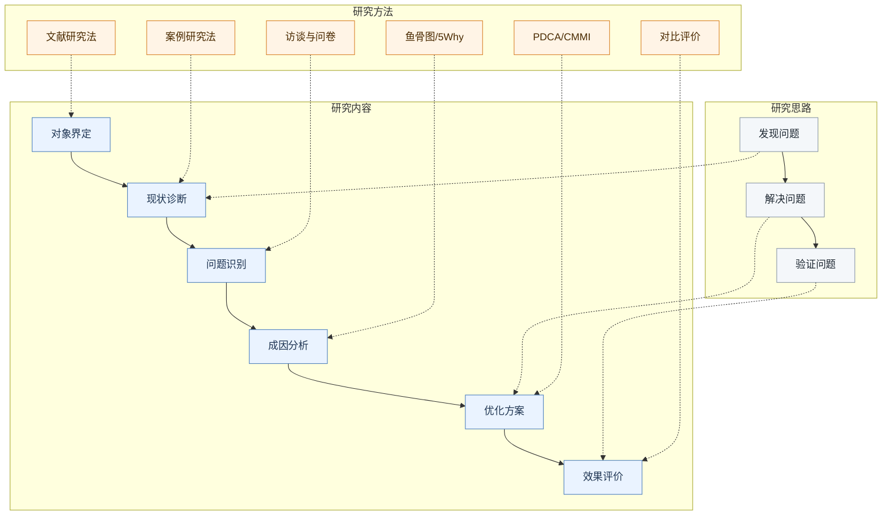
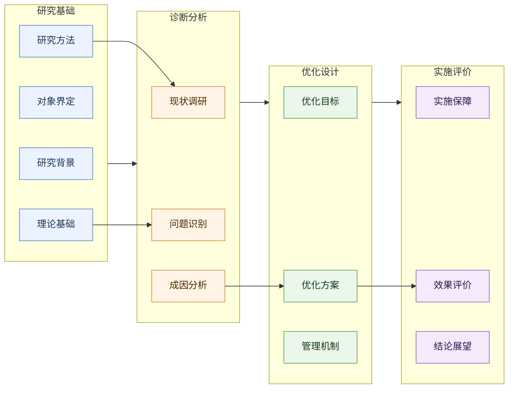

"""
图形设计技能库 - 论文研究框架图与流程图美化
用于把研究框架转换为更适合论文展示的 Mermaid 图
"""

---
topics: ["研究框架图", "Mermaid", "流程图美化", "论文图表", "可视化"]
tags: ["diagram", "mermaid", "framework", "visualization", "thesis"]
priority: high
---

# 图形设计技能库

## 目标

将研究框架从简单长链条改造成适合论文展示的分区图。图形应体现论文逻辑、模块层次和研究主线，而不是把所有节点机械串联。

## 默认图形模式

管理类、工程管理类、质量管理优化类论文优先使用四段式分区图：

```text
研究基础 → 诊断分析 → 优化设计 → 实施评价
```

每个分区用 `subgraph` 表示，分区内部放关键节点。

如果 Mermaid 自动布局导致连线混乱，优先使用“单主线 + 模块内部纵向”的保守布局：

```text
研究基础 → 诊断分析 → 优化设计 → 实施评价
```

每个模块内部只保留纵向链路，跨模块只连接模块末端到下一模块起点，避免多条跨区斜线。

## 论文技术路线图模式

当用户提供类似“研究思路/研究内容/研究方法”三层示例图时，优先使用三泳道技术路线图，而不是普通流程图。

三泳道结构：

```text
研究思路:   发现问题  →  解决问题  →  验证问题
研究内容:   对象界定 → 现状诊断 → 问题识别 → 成因分析 → 方案设计 → 效果评价
研究方法:   文献研究、案例研究、CMMI、访谈、鱼骨图、PDCA、对比评价等
```

设计原则：
- 顶部泳道只放 3-4 个阶段标签，不放细节。
- 中部泳道放研究内容，是主流程。
- 底部泳道放研究方法，用虚线箭头指向对应研究内容。
- 主流程用实线箭头，方法支撑用虚线箭头。
- 每个内容节点尽量短，必要时把细节放入节点下方或图下说明表。
- 如果 Mermaid 难以复刻复杂版式，优先保证层次和线条清晰。

## 本地模板库

可复用 SVG 模板保存在：

```text
knowledge_base/templates/framework_diagrams/
```

当前模板：
- `thesis_framework_classic.svg`: 简洁论文研究框架模板
- `thesis_framework_full.svg`: 纵向完整论文框架模板
- `thesis_framework_structure.svg`: 三列式论文框架模板

模板元数据见 `knowledge_base/templates/framework_diagrams/templates.json`。当需要生成论文级框架图时，优先参考本地模板的版式，再用脚本生成新的 SVG/PNG。

## 分区建议

### 1. 研究基础

用于放置研究的前置条件：
- 研究背景
- 研究对象
- 研究边界
- 理论基础
- 研究方法

### 2. 诊断分析

用于说明问题如何被发现：
- 现状调研
- 流程梳理
- 数据分析
- 访谈/问卷
- 问题识别
- 成因分析

### 3. 优化设计

用于呈现方案主体：
- 过程改进
- 质量闭环
- 需求管理优化
- 测试验证优化
- 缺陷闭环优化
- 度量体系优化

### 4. 实施评价

用于说明落地和验证：
- 组织保障
- 制度保障
- 工具保障
- 人员保障
- 效果评价
- 结论展望

## Mermaid 设计规则

- 优先使用 `flowchart LR` 展示四段主线；如果跨线太多，改用 `flowchart TB`。
- 使用 `subgraph` 分组，避免一个长链条贯穿全图。
- 每个分区 3-6 个节点，超过 6 个应合并概念。
- 节点文字控制在 8-18 个中文字符。
- 节点之间先连主线，谨慎补充分支。
- 跨分区连线最多保留一条主线，不要从多个理论/方法节点分别连到多个问题节点。
- 复杂依赖关系用图下文字或表格说明，不要全部画在线上。
- 理论基础和研究方法必须位于问题识别之前。
- 问题识别必须由现状调研、流程分析、数据分析或访谈材料导出。
- 不在节点里写整句解释，解释放在图下文字中。
- 使用 `classDef` 区分模块颜色，但颜色要克制，适合论文打印。

## 推荐配色

```mermaid
classDef base fill:#EAF3FF,stroke:#4F81BD,color:#1F3552;
classDef diag fill:#FFF4E6,stroke:#D9822B,color:#4A2A00;
classDef opt fill:#EAF7EA,stroke:#4E9A51,color:#173B18;
classDef eval fill:#F3EAFB,stroke:#8E5BBF,color:#32174D;
```

## 模板

### 保守清晰版

适合论文正文，优先使用。

```mermaid
flowchart LR
    subgraph S1["研究基础"]
        A1["研究背景"] --> A2["对象界定"]
        A2 --> A3["理论与方法"]
    end

    subgraph S2["诊断分析"]
        B1["现状调研"] --> B2["问题识别"]
        B2 --> B3["成因分析"]
    end

    subgraph S3["优化设计"]
        C1["优化目标"] --> C2["优化方案"]
        C2 --> C3["管理机制"]
    end

    subgraph S4["实施评价"]
        D1["实施保障"] --> D2["效果评价"]
        D2 --> D3["结论展望"]
    end

    A3 --> B1
    B3 --> C1
    C3 --> D1

    classDef base fill:#EAF3FF,stroke:#4F81BD,color:#1F3552;
    classDef diag fill:#FFF4E6,stroke:#D9822B,color:#4A2A00;
    classDef opt fill:#EAF7EA,stroke:#4E9A51,color:#173B18;
    classDef eval fill:#F3EAFB,stroke:#8E5BBF,color:#32174D;

    class A1,A2,A3 base;
    class B1,B2,B3 diag;
    class C1,C2,C3 opt;
    class D1,D2,D3 eval;
```



### 三泳道技术路线图

适合论文“研究框架图/技术路线图”，尤其适合管理类质量优化研究。



### 细节增强版

适合附录、汇报或需要展示更多节点的场景。



## 检查清单

- [ ] 是否能一眼看出研究主线？
- [ ] 是否有清晰分区，而不是单一长链？
- [ ] 如果是技术路线图，是否区分研究思路、研究内容和研究方法？
- [ ] 方法节点是否用虚线箭头支撑对应内容节点？
- [ ] 跨分区连线是否只有一条主线？
- [ ] 复杂关系是否改用图下说明，而不是画成多条交叉线？
- [ ] 理论基础和研究方法是否位于问题识别之前？
- [ ] 问题识别是否有调研或数据来源？
- [ ] 每个分区节点数量是否适中？
- [ ] 节点文字是否足够短？
- [ ] 颜色是否克制，适合论文打印？
