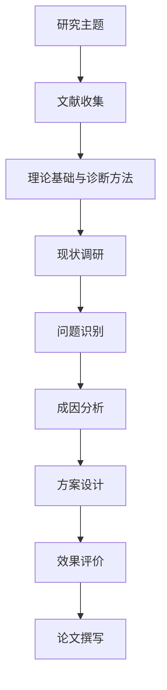
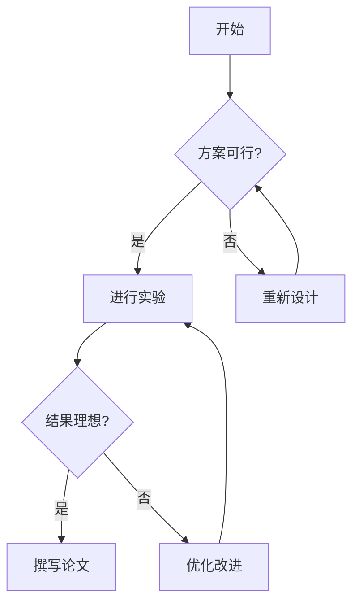
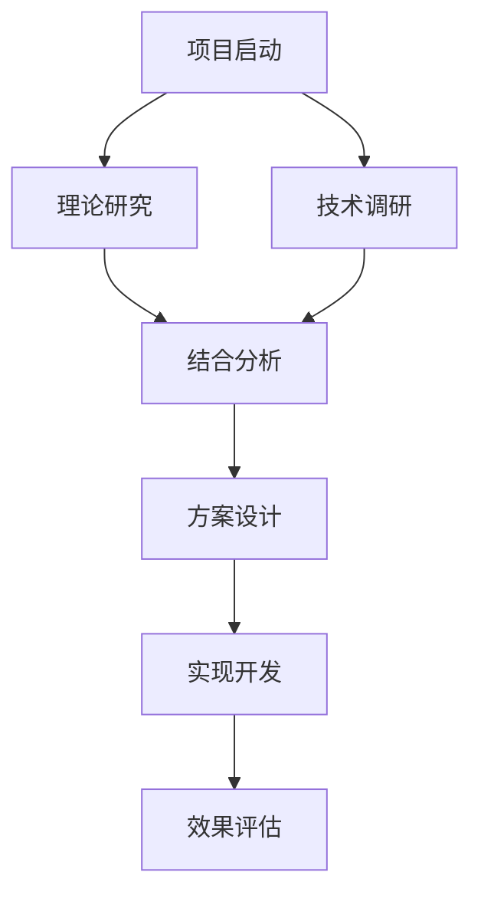
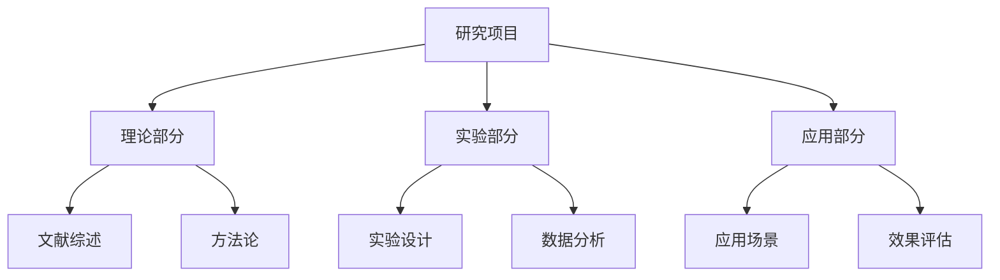

"""
框架生成技能库 - 研究框架和流程图生成知识
对应 learn-claude-code s05 Skills
"""

---
topics: ["框架生成", "流程设计", "可视化", "研究方法"]
tags: ["framework", "visualization", "research"]
priority: high
---

# 研究框架生成技能库

## 核心概念

### 什么是研究框架？

研究框架是论文核心逻辑的可视化表现，包括：
- **研究目标** - 要解决的核心问题
- **研究阶段** - 分步骤的实施方案
- **关键环节** - 重点工作内容
- **输出成果** - 阶段性和最终成果

### 框架的作用

1. **提供清晰的思路** - 明确研究的流向
2. **指导具体写作** - 为每一章节提供方向
3. **便于逻辑检查** - 发现是否有漏洞或重复
4. **便于他人理解** - 使导师和读者快速抓住要点

## 常见的研究框架模式

### 1. 顺序型框架（Sequential）
适用于有明确顺序的研究：
```
背景与对象界定 → 理论基础与方法论 → 现状调研 → 问题识别 → 成因分析 → 方案设计 → 效果评价 → 结论
```
常见学科：
- 工程类：设计 → 实现 → 测试 → 优化
- 医学类：诊断 → 治疗方案 → 临床试验 → 疗效评估
- 管理类：理论与诊断方法 → 现状分析 → 问题识别 → 优化方案 → 实施保障

### 2. 层级型框架（Hierarchical）
适用于有清晰层级关系的研究：
```
        研究主题
       /  |  \
    子题1 子题2 子题3
     / \   |   / \
```
常见学科：
- 综述论文：总论 → 分类讨论各细节
- 系统设计：整体框架 → 各子系统

### 3. 循环型框架（Cyclic）
适用于迭代改进的研究：
```
需求 → 设计 → 实现 → 测试 → 改进 → 需求(循环)
```
常见学科：
- 软件工程：敏捷开发循环
- 产品设计：用户反馈循环

### 4. 对比型框架（Comparative）
适用于对比分析的研究：
```
        对比主题
       /        \
    方案A      方案B
     / \        / \
指标1 指标2 指标1 指标2
```
常见学科：
- 算法对比：多个算法 → 性能对比
- 方案评估：多个方案 → 成本效益分析

### 5. 综合型框架（Integrated）
多种模式的组合：
```
背景与对象界定 → 理论基础与诊断方法
        ↓
     现状调研
        ↓
     问题识别
        ↓
   层级式分析
   / | | \
  子1 子2 子3
   \ | | /
     ↓
   实验验证（循环）
     ↓
   结论
```

## 学科特定的框架示例

### 计算机科学 - 深度学习论文
```
┌─ Problem Statement
│  ├─ Current Limitations
│  └─ Motivation
├─ Related Work
│  ├─ Classical Methods
│  ├─ Deep Learning Approaches
│  └─ Performance Comparison
├─ Proposed Method
│  ├─ Architecture Design
│  ├─ Algorithm Details
│  └─ Implementation
├─ Experiments
│  ├─ Dataset Preparation
│  ├─ Experimental Setup
│  └─ Result Analysis
└─ Conclusion
```

### 医学 - 新治疗方法
```
┌─ Background & Clinical Need
│  ├─ Disease Epidemiology
│  └─ Current Treatment Gaps
├─ Literature Review
│  ├─ Pathophysiology
│  └─ Existing Treatments
├─ Research Hypothesis
├─ Study Design & Methods
│  ├─ Patient Selection
│  ├─ Treatment Protocol
│  └─ Outcome Measures
├─ Results & Analysis
│  ├─ Patient Data
│  ├─ Efficacy Analysis
│  └─ Safety Profile
└─ Clinical Implications
```

### 社会科学 - 定性研究
```
┌─ Research Question
├─ Theoretical Framework
│  ├─ Existing Theories
│  └─ Conceptual Model
├─ Methodology
│  ├─ Data Collection
│  └─ Analysis Approach
├─ Findings
│  ├─ Theme 1
│  ├─ Theme 2
│  └─ Theme 3
└─ Discussion & Implications
```

### 管理类 - 质量管理优化研究
```
┌─ 研究背景与对象界定
│  ├─ 行业背景
│  ├─ 企业/项目背景
│  └─ 研究边界
├─ 理论基础与诊断方法
│  ├─ 项目质量管理理论
│  ├─ 持续改进理论（PDCA等）
│  ├─ 过程改进模型（CMMI/Scrum等）
│  └─ 问题识别方法（访谈、数据分析、流程诊断、根因分析）
├─ 现状调研与资料收集
│  ├─ 流程梳理
│  ├─ 质量数据统计
│  ├─ 访谈/问卷
│  └─ 案例材料分析
├─ 核心问题识别
│  ├─ 需求管理问题
│  ├─ 流程质量问题
│  ├─ 测试验证问题
│  └─ 度量与闭环问题
├─ 成因分析
├─ 优化方案设计
├─ 实施保障
└─ 效果评价与结论
```

## 框架生成的步骤

### 第1步: 明确研究背景、对象和边界
- 研究对象是什么？
- 研究场景和行业背景是什么？
- 研究边界包括哪些流程、部门、系统或阶段？

### 第2步: 确定理论基础和诊断方法
- 用哪些理论解释研究对象？
- 用哪些方法识别问题？
- 理论、方法和后续问题识别是否对应？

### 第3步: 设计现状调研路径
- 需要收集哪些流程、制度、数据或访谈材料？
- 资料来源是否足以支撑问题识别？
- 是否能避免凭经验直接列问题？

### 第4步: 识别核心问题
- 主研究问题是什么？
- 有几个子问题？
- 每个问题由什么数据、流程证据或访谈材料支撑？
- 问题之间的关系是什么？

### 第5步: 识别主要阶段
- 研究分几个阶段？
- 每个阶段的目标是什么？
- 阶段之间的依赖关系？

### 第6步: 设计关键活动
- 每个阶段包含哪些具体活动？
- 活动与研究目标如何对应？
- 是否有并行或重叠？

### 第7步: 定义输出成果
- 每个阶段的输出是什么？
- 最终产出是什么？
- 如何验证成果？

### 第8步: 可视化表达
- 选择合适的图形表示
- 标注关键节点和连接
- 确保逻辑清晰明确

## Mermaid 流程图代码示例

### 论文研究框架图优先规则

生成论文研究框架图时，优先参考 `skills/DIAGRAM_DESIGN.md` 的分区图规则。管理类、工程管理类、质量管理优化类论文不要默认生成单一长链条，应优先使用：

```
研究基础 → 诊断分析 → 优化设计 → 实施评价
```

图中应体现：
- 理论基础和研究方法在问题识别之前
- 问题识别来自现状调研、流程分析、数据分析、访谈或案例材料
- 优化方案由问题成因推导出来
- 效果评价和实施保障放在框架末端
- 使用 `subgraph` 和 `classDef` 提升可读性

### 基础顺序流


### 有决策的流程


### 分支并行


### 层级结构


## PlantUML 高级框架图

```plantuml
@startwbs
* 研究主题
 ** 背景分析
  *** 市场现状
  *** 技术趋势
  *** 问题机遇
 ** 理论基础
  *** 基本概念
  *** 相关模型
  *** 已有方案
 ** 研究方法
  *** 数据收集
  *** 处理方法
  *** 分析工具
 ** 实验验证
  *** 对比实验
  *** 性能测试
  *** 有效性验证
 ** 成果应用
  *** 理论贡献
  *** 实践意义
  *** 后续方向
@endwbs
```

## 框架优化检查清单

- [ ] 是否清晰表现了研究的完整流程？
- [ ] 主要阶段是否按逻辑顺序排列？
- [ ] 核心问题是否在理论基础和诊断方法之后提出？
- [ ] 问题识别是否有数据、流程、访谈或案例证据支撑？
- [ ] 是否包含所有关键要素？
- [ ] 是否避免了重复或遗漏？
- [ ] 是否与论文章节结构相对应？
- [ ] 是否便于他人理解论文思路？
- [ ] 图表是否美观清晰？
- [ ] 标签说明是否准确简洁？

## 常见框架问题及改进

### 问题1: 框架过于简单
**表现**: 只有几个方框连接
**改进**: 增加层级深度，细化各阶段内容

### 问题2: 框架过于复杂
**表现**: 节点太多，难以理解
**改进**: 按层级分组，简化视觉表现

### 问题3: 逻辑不清
**表现**: 节点间关系模糊
**改进**: 明确标注节点关系，添加说明

### 问题4: 与内容不符
**表现**: 框架与最终论文内容不一致
**改进**: 定期更新框架，确保与进展同步

### 问题5: 先列问题后补理论
**表现**: 核心问题出现在理论基础和研究方法之前，像是主观判断
**改进**: 调整为“理论基础与诊断方法 → 现状调研 → 问题识别”，并说明每类问题的识别依据

## 框架在论文中的展现

### 位置
- 通常放在绪论末尾或第二章开头
- 也可以在摘要中简要描述

### 说明文字
```
图X 研究框架流程图
本论文采用以下研究路线：
首先，通过文献综述了解...
其次，针对存在的问题...
最后，通过实验验证...
```

### 与大纲的对应
- 框架中的每个主要节点对应论文的一个章节
- 框架的分支可以对应各章的小节

---

**生成建议**:
- 在正式写作前画出框架
- 定期检查框架与实际进展是否一致
- 框架要简洁，不要过度复杂
- 确保框架能清楚表达研究的核心逻辑
